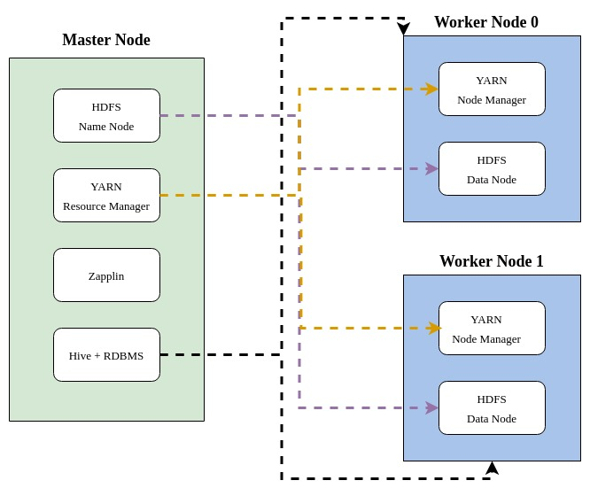

# Hadoop Project

## Introduction
In this project, Apache Hadoop was employed to analyze and process the World Development 
Indicators (WDI) dataset which contains about 22 million data points.

The project was built using Hadoop and Hive. Hadoop cluster was provisioned using Google
Cloud Platform (GCP). All queries and their respective results were saved to a Zeppelin notebook

## Hadoop Cluster
The Hadoop cluster architecture is shown below which contains one master node and two worker
nodes.

### Big Data Tools Used
* **Hadoop**
> Is an open-source framework that is used to efficiently store and process large datasets 
> in a distributed fashion.

* **Hadoop Distributed File System (HDFS)**
> Is a distributed file system. It utilizes the master/slave architecture to tackle big data
> problems.

* **Yet Another Resource Negotiator**
> Responsible for allocating system resources to the various applications running in a Hadoop cluster 
> and scheduling tasks to be executed on different cluster nodes.

* **Zeppelin**
> Online notebook that enables the user to process and analyze the data on a Hadoop cluster.

* **MapReduce**
> Is a programming model that allows for data processing in batches. As the name suggests
> MapReduce is divided into two phases: the map phase which transforms the data into a Key-Value pair
> and the reduce phase which aggregates the Key-Value pair input for the result.

* **Hive**
> Is an application that runs on top of the Hadoop framework and provides an SQL-like interface
> for processing/querying data.

The Hadoop cluster was provisioned using Google Cloud Platform's Dataproc. One master node
and two worker nodes were employed, each containing 12 GB of memory with 100 GB of disk space.

## Hive Project
The utilization of optimization tools is essential when processing and analyzing big datasets.
In this project, the World Development Indicators (WDI) dataset was analyzed which contained 
about 22 million rows of data occupying around 2.2 GB of space. The data was firstly exported
from GCP storage to HDFS. Afterward, the data was examined using the following optimization
tools:

* **Partitioning**: This basically breaks down the data into smaller chunks allowing data 
access to be more efficient since only a specific partition can be loaded into memory instead of
the entire dataset.

* **Columnar File Format**: Stores the data in a column-oriented structure. This allows data
retrieval to be much faster since in the case we need a vale from each row in the table, they
all can be found in one column. Without the columnar file format, each row in the table will
need to be visited to retrieve the required data.

Shown below is my Zeppelin notebook containing the Hive queries

## Improvements

* **Employing More Worker Nodes**: Since in this project we only used two worker nodes, increasing
the number of worker nodes will allow for a faster runtime since jobs will be spread across more
nodes

* **Using Spark**: When tested, Spark has a better performance when compared to Hadoop. Therefore,
the runtime for each query can be reduced.

* **Using Map Join**: Map join can be used to speed up Hive queries by allowing a table to be 
loaded into memory so that a join can be performed in the map phase of the MapReduce job. Since
no reducers are necessary, map joins are significantly faster than regular joins.
